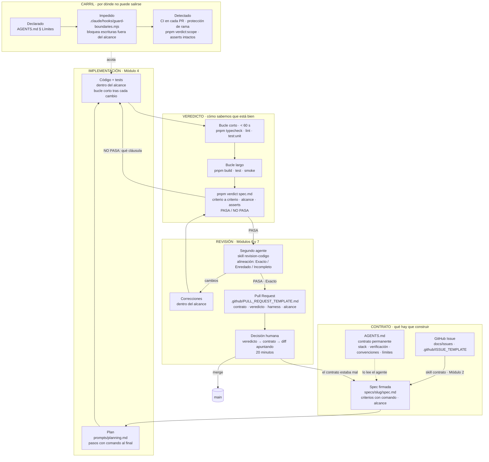

# Diagrama de arquitectura · del Issue a la PR verificada

El ciclo completo, con las tres capas del sistema: contrato, carril y
veredicto. Cada caja nombra el artefacto o el comando real de este repo.



## Los diez pasos, en una línea cada uno

| # | Paso | Artefacto o comando | Módulo |
|---|---|---|---|
| 1 | GitHub Issue | `docs/issues/*.md`, plantillas de issue | 2 |
| 2 | Spec | `specs/<slug>/spec.md` desde `specs/spec.template.md` | 2 |
| 3 | Contexto + Harness | `AGENTS.md`, hook, CI, `harness-init` | 3 |
| 4 | Plan | `prompts/planning.md` | 4 |
| 5 | Implementación | `prompts/scoped-implementation.md`, bucle corto | 4 |
| 6 | Tests + Checks | `pnpm typecheck && pnpm lint && pnpm test` | 5 |
| 7 | Veredicto | `pnpm verdict specs/<slug>/spec.md --write` | 5 |
| 8 | Code Review | skill `revision-codigo` / `prompts/code-review.md` | 6 |
| 9 | Pull Request | skill `revision-pr` / plantilla de PR | 7 |
| 10 | Decisión humana | `docs/workflows/pr-review.md` | 7 |

## Cómo exportarlo

GitHub renderiza el bloque `mermaid` directamente. Para PNG o SVG en alta
resolución (el "mapa visual" del workshop):

```bash
npx -y @mermaid-js/mermaid-cli -i docs/architecture-diagram.md -o docs/architecture-diagram.svg -b transparent
```
